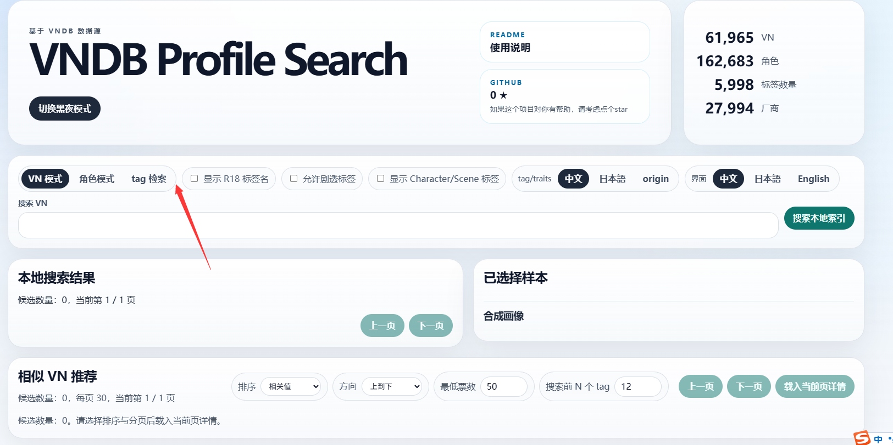
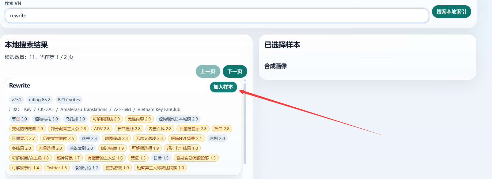
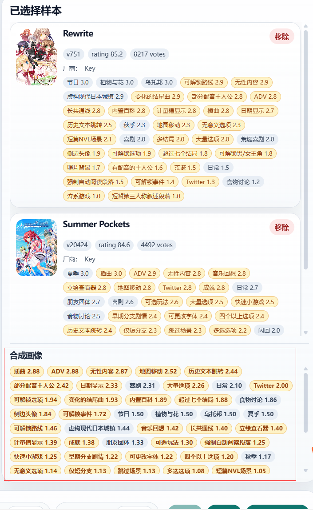
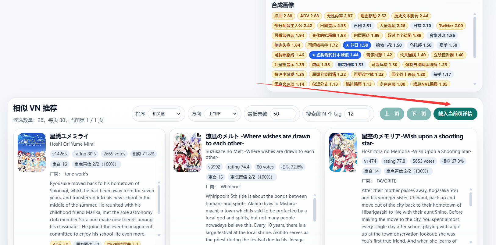
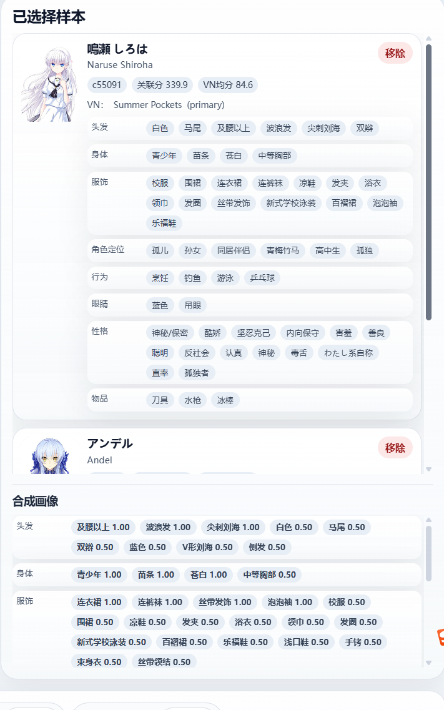
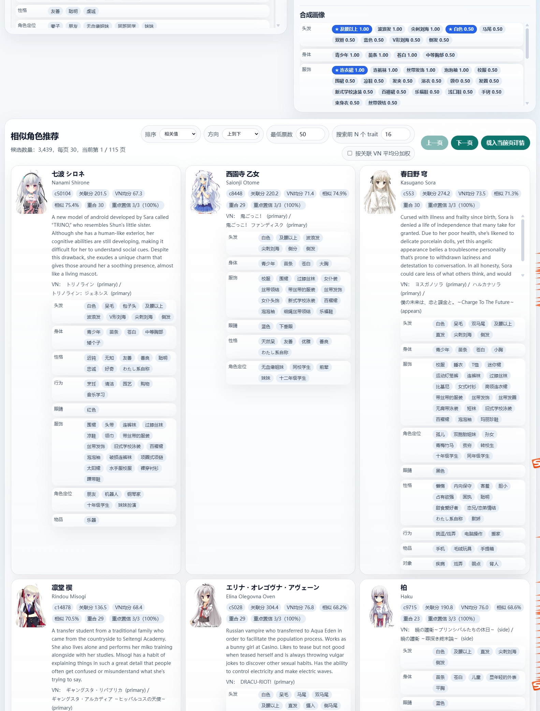
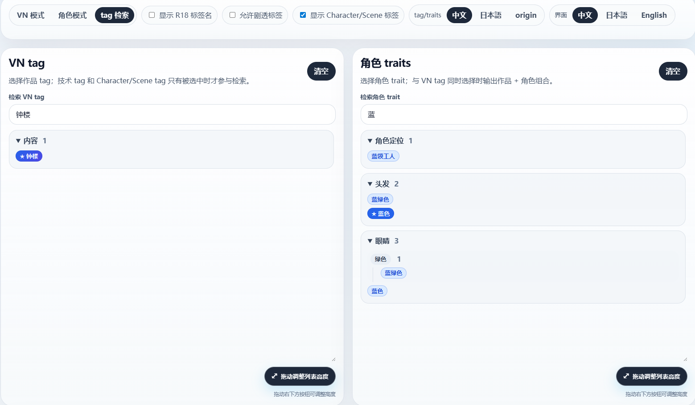
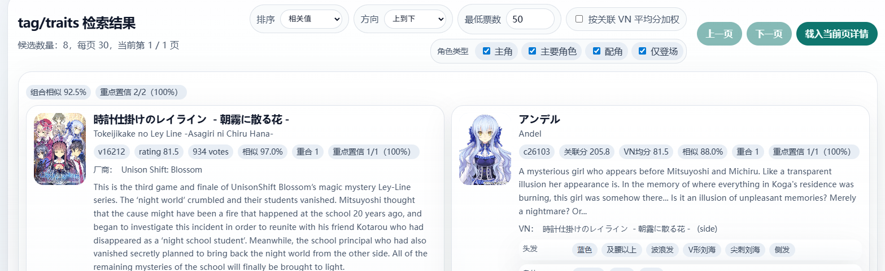

# 使用说明

## 1. 切换工作模式

点击顶部模式按钮切换工作模式：搜索作品、搜索角色，或使用标签精确搜索。

## 2. 添加 VN 样本

输入你感兴趣的 VN 标题后，点击搜索结果中的添加按钮，将其加入样本池。

## 3. 标记重点 Tag

添加多个样本后，红框内容会显示所有样本的 Tag 权重。点击红框内的 Tag 即可将其标记为重点，使其必定参与搜索，并将权重提高到 200%。

## 4. 载入当前页详情

调整完相关参数之后，点击“载入当前页详情”，即可开始请求 VNDB Kana API，请求搜索结果的详细信息并展示。

## 5. 角色搜索

角色搜索也是同样的操作流程：先搜索角色并添加样本，再根据合成画像和参数获取相似角色推荐。

## 6. 标签检索模式

调整至标签检索模式之后，可以精确查找任何包含你指定标签的作品和/或角色。

## 7. 同时选择 Tag 与 Trait

如图所示，同时选择 Tag 与 Trait 即可精确查找包含这两个标签的作品与对应角色。只选择其中一边时，效果等同于单侧精确搜索。

